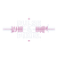

<div align="center">
  
  <h1>Pulse & Pixel</h1>
  <h3>AI-Powered Branding & Digital Identity</h3>
  <p>PLP AI Safari Assignment | July 2025 Cohort</p>
  
  [](https://creativecommons.org/licenses/by-nc-nd/4.0/)
  [](https://github.com/secbyteX03/PLP-PulseAndPixel)
</div>

---

## 🎯 Project Overview

Pulse & Pixel is a digital branding agency that leverages AI to create compelling brand identities, marketing content, and digital experiences. This project demonstrates the power of AI in modern branding and digital marketing.

<div align="center">
  
  <p><em>Our primary logo in color</em></p>
</div>

---

## 🎨 Brand Identity

### Logo Variations

| Light Background | Dark Background |
|------------------|-----------------|
|  |  |
| *Horizontal - Color* | *Horizontal - White* |
|  |  |
| *Stacked - Color* | *Stacked - White* |

### Color Palette

```
Primary:   #6C63FF (Violet)   RGB(108, 99, 255)
Secondary: #FF6584 (Pink)     RGB(255, 101, 132)
Accent:    #00C9B6 (Teal)     RGB(0, 201, 182)
Dark:      #0B1F3A (Navy)     RGB(11, 31, 58)
Light:     #F5F7FA (Off-White) RGB(245, 247, 250)
```

### Typography
- **Primary Font:** Poppins (SemiBold 600)
- **Secondary Font:** Montserrat (Regular 400)
- **Code Font:** Fira Code (for technical content)

---

## 🚀 Project Structure

### Phase 1: Branding & Business Setup
- **Brand Strategy** - Mission, vision, and values
- **Visual Identity** - Logos, color schemes, and typography
- **Brand Voice** - Tone, style, and messaging guidelines

### Phase 2: AI-Generated Design & Content
- **Marketing Materials** - Social media posts, ads, and blog content
- **Website Design** - UI/UX mockups and prototypes
- **Content Strategy** - Editorial calendar and content planning

### Phase 3: Client Outreach & Monetization
- **Pitch Decks** - Investor and client presentations
- **Sales Materials** - Brochures, case studies, and testimonials
- **Outreach Campaigns** - Email templates and follow-up sequences

---

## 🛠️ Technical Implementation

### Tools & Technologies

| Category | Tools |
|----------|-------|
| **AI Tools** | ChatGPT, Canva Magic Media, DALL-E |
| **Design** | Figma, Adobe Creative Cloud |
| **Development** | HTML5, CSS3, JavaScript, React |
| **Analytics** | Google Analytics, Hotjar |
| **Project Management** | GitHub, Trello |

### File Structure

```
PLP-PulseAndPixel/
├── 1_Branding/          # Brand guidelines and assets
├── 2_Logo/              # Logo files and usage guidelines
├── 3_Marketing/         # Marketing content and campaigns
├── 4_Website/           # Website mockups and content
├── 5_Pitch/             # Sales and pitch materials
├── 6_Demo/              # Demo materials
├── images/              # All visual assets
├── prompts/             # AI prompts used
└── scripts/             # Utility scripts
```

---

## 📱 Responsive Design

<div align="center">
  
  
  <p><em>Our logo adapts to different contexts and backgrounds</em></p>
</div>

---

## 🌐 Web Assets

### Favicon

| Size | Preview |
|------|---------|
| 16x16 |  |
| 32x32 |  |
| 64x64 |  |

---

## 📝 Usage Guidelines

### Logo Usage
- Maintain minimum clear space around the logo (50% of logo height)
- Minimum logo size: 24px in height for digital, 0.5" for print
- Always use high-resolution versions for print materials
- Never stretch, skew, or alter the logo proportions

### Color Application
- Use primary colors for key brand elements
- Secondary colors for accents and highlights
- Ensure sufficient contrast for accessibility (WCAG 2.1 AA compliant)

### Typography
- Use Poppins for headings and display text
- Montserrat for body copy and longer text blocks
- Maintain consistent hierarchy and spacing

---

## 📊 Brand Applications

### Business Cards
```
Front:
[Logo] Pulse & Pixel
[Name]
[Title]

Back:
[Contact Information]
[Website] [Social Media Handles]
```

### Email Signature
```
[Name]
[Title] | Pulse & Pixel

[Phone] | [Email]
[Website] | [LinkedIn]
```

---

## 📚 Resources

- [Brand Guidelines (PDF)](#)
- [Logo Package (ZIP)](#)
- [Marketing Templates (Canva)](#)
- [Style Guide (Figma)](#)

---

## 📄 License

This project and its contents are licensed under the [Creative Commons Attribution-NonCommercial-NoDerivatives 4.0 International License](http://creativecommons.org/licenses/by-nc-nd/4.0/).

---

<div align="center">
  <p>Created with ❤️ for PLP AI Safari Assignment</p>
  <p>© 2025 Pulse & Pixel. All rights reserved.</p>
</div>
