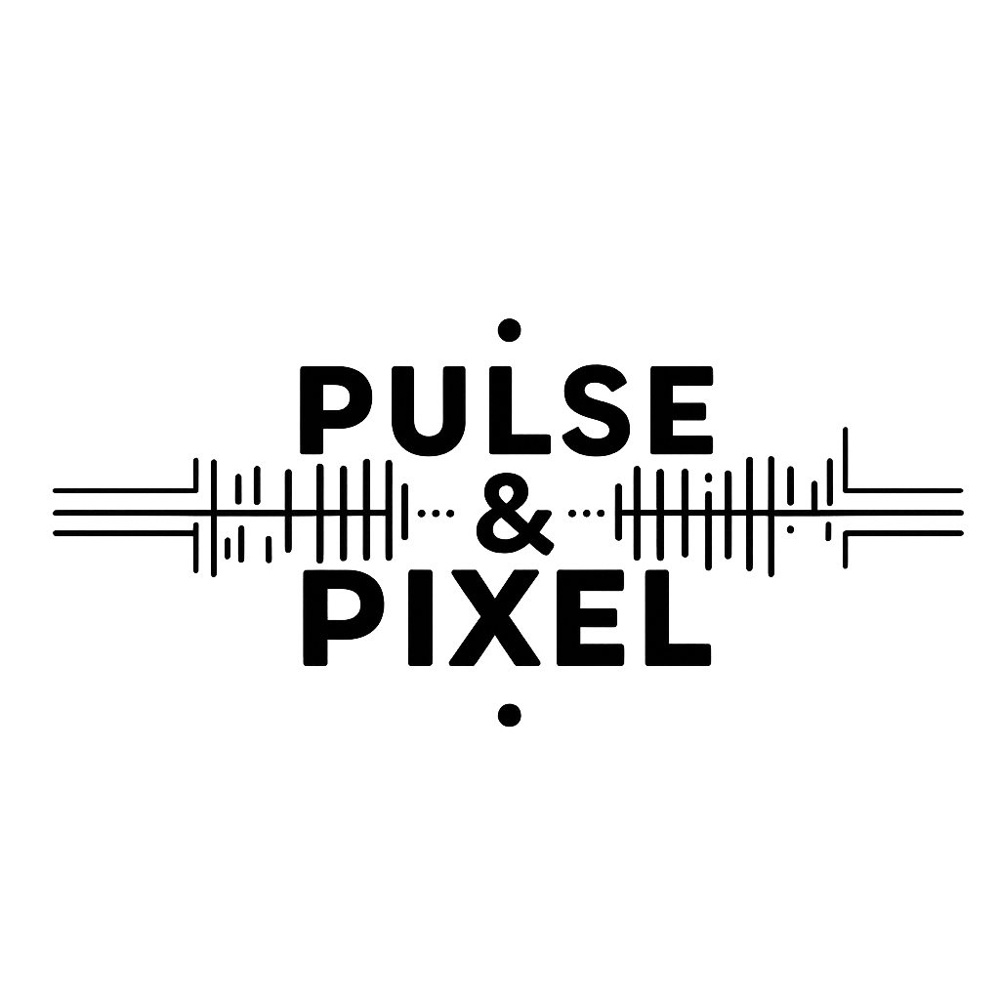

# AI-Powered Branding Agency: Pulse & Pixel

**PLP AI Safari Assignment | July 2025 Cohort**  
**Student Name:** Magret Faith  
**Submission Date:** September 5, 2025

<div align="center">
  
  <h1>Pulse & Pixel</h1>
  <h3>AI-Powered Branding & Digital Identity</h3>
  
  [](https://creativecommons.org/licenses/by-nc-nd/4.0/)
  [](https://github.com/secbyteX03/PLP-PulseAndPixel)
</div>

---

## 📋 Table of Contents
- [Assignment Overview](#-assignment-overview)
- [Learning Objectives](#-learning-objectives)
- [Phase 1: Branding & Business Setup](#-phase-1-branding--business-setup)
- [Phase 2: AI-Generated Design & Marketing Content](#-phase-2-ai-generated-design--marketing-content)
- [Phase 3: Client Outreach & Monetization](#-phase-3-client-outreach--monetization)
- [Project Structure](#-project-structure)
- [AI Tools & Prompts Used](#-ai-tools--prompts-used)
- [Deliverables](#-deliverables)
- [Reflection](#-reflection)
- [License](#-license)

---

## 🎯 Assignment Overview

This submission showcases my work for the PLP AI Safari Assignment, where I've created an AI-powered digital branding agency called "Pulse & Pixel." The project demonstrates how AI tools like ChatGPT and Canva Magic Media can be leveraged to create a complete brand identity and marketing strategy.

## 🎓 Learning Objectives

Through this assignment, I've achieved the following learning objectives:

1. **Understanding AI in Branding**
   - Explored the role of AI in modern branding and digital marketing
   - Learned how AI can enhance creativity and efficiency in design processes

2. **ChatGPT for Branding**
   - Generated compelling brand stories and marketing copy
   - Created structured business strategies and client communication templates

3. **Canva Magic Media**
   - Designed brand assets including logos and social media graphics
   - Developed marketing materials and presentation decks

4. **Business Strategy**
   - Developed a structured approach to branding and client acquisition
   - Created monetization strategies for AI-powered branding services

---

## 🔹 Phase 1: Branding & Business Setup

### Business Identity
- **Business Name:** Pulse & Pixel
- **Tagline:** "Where AI Meets Creative Genius"
- **Mission Statement:** "To empower businesses with AI-driven branding solutions that are innovative, efficient, and impactful."

### Brand Story (AI-Generated)
> *[Excerpt from generated brand story] In a world where first impressions are digital, Pulse & Pixel emerged from a simple idea: what if artificial intelligence could capture the essence of a brand and translate it into stunning visual and verbal identities? Founded in 2025, our journey began with a team of forward-thinkers who saw the untapped potential of AI in creative industries...*

### Visual Identity

#### Logo Variations
| Light Background | Dark Background |
|------------------|-----------------|
|  |  |
| *Horizontal - Color* | *Horizontal - White* |
|  |  |
| *Stacked - Color* | *Stacked - White* |

#### Color Palette
```
Primary:   #6C63FF (Violet)   RGB(108, 99, 255)
Secondary: #FF6584 (Pink)     RGB(255, 101, 132)
Accent:    #00C9B6 (Teal)     RGB(0, 201, 182)
Dark:      #0B1F3A (Navy)     RGB(11, 31, 58)
Light:     #F5F7FA (Off-White) RGB(245, 247, 250)
```

#### Typography
- **Primary Font:** Poppins (SemiBold 600)
- **Secondary Font:** Montserrat (Regular 400)
- **Code Font:** Fira Code (for technical content)

#### Brand Voice & Tone
- **Tone:** Professional yet approachable
- **Style:** Clear, concise, and innovative
- **Key Messages:** Emphasizing AI-powered solutions, creativity, and measurable results

**AI Prompt Used:**  
*"Imagine you're creating a futuristic digital branding agency powered by AI. Generate a business name, tagline, and a compelling brand story that appeals to startups."*

---

## 🔹 Phase 2: AI-Generated Design & Marketing Content

### Social Media Content

#### Sample Social Media Posts (AI-Generated)
1. **Post 1: The Power of AI in Branding**  
   *[Sample post content about AI branding benefits]*
[](images/social-media-content-1.png) 

2. **Post 2: Branding Trends 2025**  
   *[Sample post content about trends]*
[](images/social-media-content-2.png) 

3. **Post 3: Case Study: Startup Transformation**  
   *[Sample case study content]*
[](images/social-media-content-3.png) 

**AI Prompt Used:**  
*"Generate five engaging social media post ideas that promote AI-powered branding services. Each post should have a call to action."*

### Website Mockups

#### Homepage Design
[](images/website-mockup.png)  
*Click to view full-size mockup*

#### Key Pages:
1. **Home** - Value proposition and services
2. **Portfolio** - Showcase of AI-generated branding projects
3. **Services** - Detailed service offerings
4. **About** - Brand story and team
5. **Contact** - Inquiry form and contact information

### Blog Content

#### Sample Blog Post: "Why AI is the Future of Branding"
> *[Excerpt from AI-generated blog post] In today's fast-paced digital landscape, businesses need to stand out more than ever. Artificial Intelligence is revolutionizing the way we approach branding, offering unprecedented speed, personalization, and creativity...*

**AI Prompt Used:**  
*"Write an AI-generated blog post explaining why businesses should use AI-powered branding services to stay competitive."*

### Marketing Materials

#### Social Media Graphics
[](images/social-media-1.png)  
[](images/social-media-2.png)

**Canva Magic Media Prompt:**  
*"Generate an AI image of a vibrant social media post showcasing the power of AI branding for businesses."*

---

## 🔹 Phase 3: Client Outreach & Monetization

### Sales Strategy

#### Target Market
- Startups and small businesses
- E-commerce brands
- Tech companies
- Entrepreneurs and solopreneurs

#### Service Packages
1. **Starter Package** - Basic brand identity
2. **Growth Package** - Comprehensive branding + marketing materials
3. **Enterprise Package** - Full-service branding with ongoing support

### Sales Pitch (AI-Generated)
> *[Excerpt from sales pitch] Dear [Client Name], In today's competitive digital landscape, your brand needs to make an unforgettable first impression. At Pulse & Pixel, we combine cutting-edge AI with creative expertise to deliver branding solutions that truly represent your business...*"

**AI Prompt Used:**  
*"Write a persuasive email to a potential client explaining how AI-generated branding can help elevate their business presence."*

### Pitch Deck
[View Full Pitch Deck](5_Pitch/pulse_pixel_pitch_deck.pdf)

**Canva Presentation Prompt:**  
*"Design a clean and compelling presentation slide that highlights the advantages of AI-generated branding for startups and small businesses."*

### Outreach Campaign

#### Email Sequence
1. **Initial Contact** - Introduction to services
2. **Follow-up** - Case study showcase
3. **Special Offer** - Limited-time discount
4. **Closing** - Final call to action

#### Social Media Campaign
- LinkedIn outreach strategy
- Instagram/Facebook ad campaign
- Webinar series on AI in branding

---

## 🗂 Project Structure

```
PLP-PulseAndPixel/
├── 1_Branding/          # Phase 1: Brand guidelines and assets
│   ├── brand_story.md   # AI-generated brand narrative
│   ├── voice_tone.md    # Brand voice guidelines
│   └── style_guide/     # Visual style references
│
├── 2_Logo/              # Logo files and usage
│   ├── logo_horizontal_color.png
│   ├── logo_horizontal_white.png
│   ├── logo_stacked_color.png
│   └── logo_stacked_white.png
│
├── 3_Marketing/         # Phase 2: Marketing content
│   ├── social_media/    # Posts and graphics
│   ├── blog_posts/      # AI-generated articles
│   └── email_templates/ # Marketing emails
│
├── 4_Website/           # Website design
│   ├── mockups/         # UI/UX designs
│   ├── content/         # Web copy
│   └── assets/          # Web graphics
│
├── 5_Pitch/             # Phase 3: Sales materials
│   ├── pitch_deck.pdf   # Client presentation
│   ├── case_studies/    # Success stories
│   └── proposals/       # Client proposals
│
├── 6_Demo/              # Demo materials
│   ├── video_demo.mp4   # Product demo
│   └── screenshots/     # Demo images
│
├── images/              # All visual assets
├── prompts/             # AI prompts used
├── scripts/             # Utility scripts
└── README.md            # Project documentation
```

---

## 🤖 AI Tools & Prompts Used

### ChatGPT Prompts
1. **Brand Development**
   - Business name and tagline generation
   - Brand story creation
   - Value proposition development

2. **Content Creation**
   - Blog post generation
   - Social media content
   - Email templates
   - Sales copy

3. **Strategy Development**
   - Marketing strategy
   - Client outreach approach
   - Service packaging

### Canva Magic Media
1. **Logo Design**
   - Primary logo creation
   - Logo variations
   - Favicon generation

2. **Marketing Materials**
   - Social media graphics
   - Presentation slides
   - Promotional banners

---

## 📦 Deliverables

### Phase 1: Branding & Business Setup
- [x] Business name, tagline, and mission statement
- [x] AI-generated brand story
- [x] Logo design and variations
- [x] Color palette and typography
- [x] Brand voice guidelines

### Phase 2: AI-Generated Design & Content
- [x] Social media content calendar (3 sample posts)
- [x] Blog post on AI in branding
- [x] Website mockups (key pages)
- [x] Marketing email templates

### Phase 3: Client Outreach & Monetization
- [x] Sales pitch email template
- [x] Service packages and pricing
- [x] Pitch deck
- [x] Outreach campaign strategy

### Additional Assets
- [x] Favicon set (16x16, 32x32, 64x64, Apple Touch)
- [x] Social media profile images
- [x] Email signature template
- [x] Business card design

---

## 💭 Reflection

### Challenges Faced
1. **AI Limitations**
   - Ensuring brand consistency across AI-generated content
   - Fine-tuning prompts for desired outputs

2. **Design Considerations**
   - Balancing AI creativity with brand guidelines
   - Creating versatile assets for different platforms

### Key Learnings
1. **AI as a Creative Partner**
   - AI significantly speeds up the ideation process
   - Human oversight remains crucial for quality control

2. **Branding Insights**
   - The importance of consistency across all touchpoints
   - How AI can enhance but not replace human creativity

### Future Improvements
1. Expand the brand asset library
2. Develop more detailed case studies
3. Create interactive brand guidelines
4. Build a client portal for asset management

---

## 📄 License

This project and its contents are licensed under the [Creative Commons Attribution-NonCommercial-NoDerivatives 4.0 International License](http://creativecommons.org/licenses/by-nc-nd/4.0/).

---

<div align="center">
  <p>Created with ❤️ for PLP AI Safari Assignment | July 2025 Cohort</p>
  <p>© 2025 Pulse & Pixel. All rights reserved.</p>
</div>
